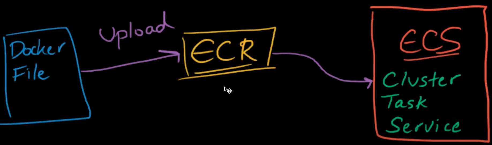
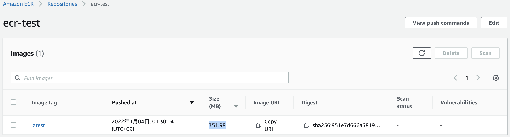
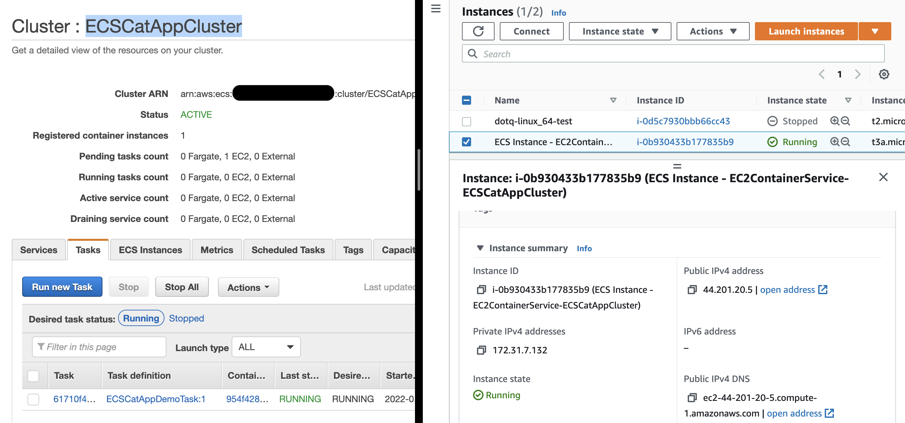

# aws-ecr-ecs-flask-viewpics 🐳


[](https://github.com/tquangdo/aws-ecr-ecs-flask-viewpics/issues/new)



## reference
1. [youtube](https://www.youtube.com/playlist?list=PL9nWRykSBSFihWbXBDX57EdpOmZxpUaVR)
2. [github](https://github.com/prakhar1989/docker-curriculum)

## deploy local
+ note: `Dockerfile > FROM python:3.9` -> will ERR if python ver > 3.9!!!
```shell
docker build -t test .
docker run -d --publish 8888:5000 test
docker ps
CONTAINER ID   IMAGE     COMMAND             CREATED         STATUS         PORTS                                       NAMES
a6eea6eec475   test      "python ./app.py"   4 seconds ago   Up 2 seconds   0.0.0.0:8888->5000/tcp, :::8888->5000/tcp   nice_wozniak
```
+ access `localhost:8888` on browser will see random cat pictures in `app.py > images = [...]`

## ecr
```shell
aws ecr get-login-password --region us-east-1 | docker login --username AWS --password-stdin ACCOUNTIDHERE!!!.dkr.ecr.us-east-1.amazonaws.com
Login Succeeded
```
+ create repo `ecr-test`
```shell
docker tag test:latest ACCOUNTIDHERE!!!.dkr.ecr.us-east-1.amazonaws.com/ecr-test:latest
docker push ACCOUNTIDHERE!!!.dkr.ecr.us-east-1.amazonaws.com/ecr-test:latest
```


## ecs
### create cluster:
+ template=`EC2 Linux + Networking`
+ cluster name=`ECSCatAppCluster`
+ EC2 instance type=`t3a.micro`
+ Subnets=`...us-east-1a`
+ Auto assign public IP=`Enabled`
+ Security group=`default`
### create task definition
+ launch type=`EC2`
+ Task definition name=`ECSCatAppDemoTask`
+ Task role=`None`
+ Task memory (MiB) = Task CPU (unit) = 512
#### add container
+ Container name=`CatAppContainer`
+ Image=`ACCOUNTIDHERE!!!.dkr.ecr.us-east-1.amazonaws.com/ecr-test:latest`
+ Port mappings=`8888 | 5000`
### run new task
+ Launch type=`EC2`
+ final result: ecs map with EC2


## deploy ec2
### Security group=`default`
+ add `Inbound rules`: TCP + 8888 + 0.0.0.0/0
+ access `http://ec2-44-201-20-5.compute-1.amazonaws.com:8888/` on browser will see random cat pictures
